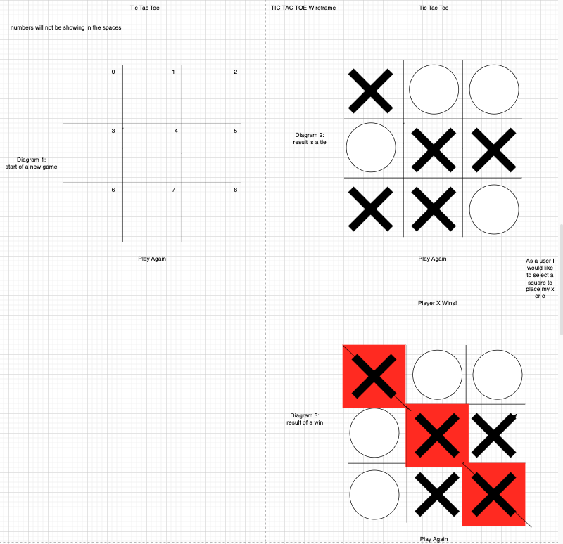
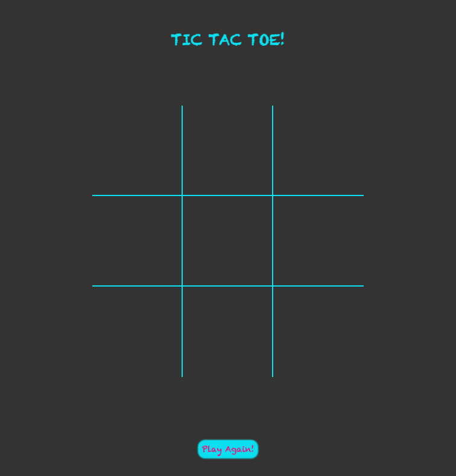
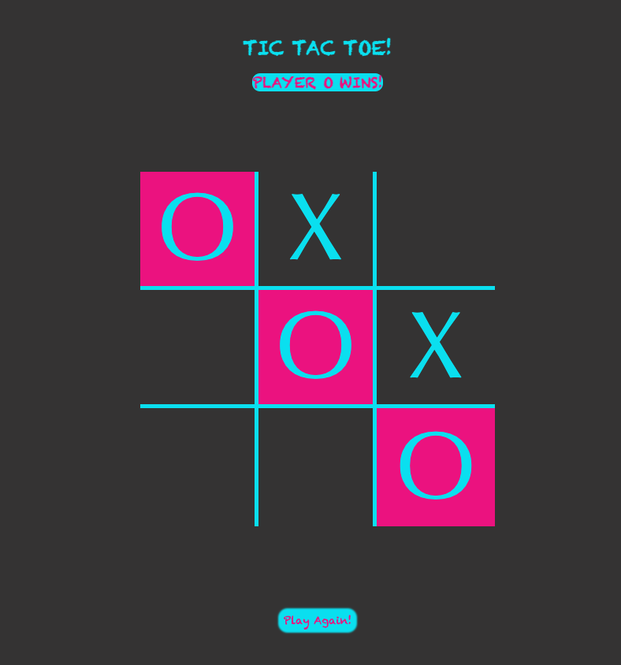

# Tic Tac Toe
Tic Tac Toe is a game in which two players seek in alternate turns to complete a row, a column, or a diagonal with either three O's or three X's drawn in the spaces of a grid of nine squares.
## Technologies used
HTML, CSS, JAVASCRIPT, Visual Studio Code, and used my mac laptop to access and use these technologies.
## Getting Started
1) Click the following link to get to the game board -> https://nicodenelli.github.io/Tic-Tac-Toe-Project/

2) Once the gameboard is loaded, players must decide who will go first, player-1 will always be "O" and player-2 will always be "X"

3) At any point during the game if a row, column, or diagonal exist of three consecutive O's or X's the game will end and the title will change displaying the winner of the game. 

4) If the gameboard is filled with characters and neither player has won the title will remain unchanged and the option to reset the gameboard will be available in a button below the board labeled "PLay Again!"
## Screenshots
Wireframe

Gameboard

Gameboard-Win

## Next Steps
1) I want to add functionality to the title, to change it's display in the case of a tie as I do this for when there is a win, something simple like "It's a Draw!"

2) I also want to enhance the game so that users accessing the game can play against the computer, and to keep track of the wins by storing the win tally in another object visible on the screen. When "Play Again!" is selected this tally of wins will not reset, and instead I can add a new reset button, so the reset button can set the overall tally of wins back to 0 as well when a user would like to start their series of games over.

3) Currently the game allows whoever the winner is to keep placing their piece on the board until the entire board is full of X or O values, I would like to make it so once a win is established that the game ends and the only action that can be taken after that point is to restart the game.

